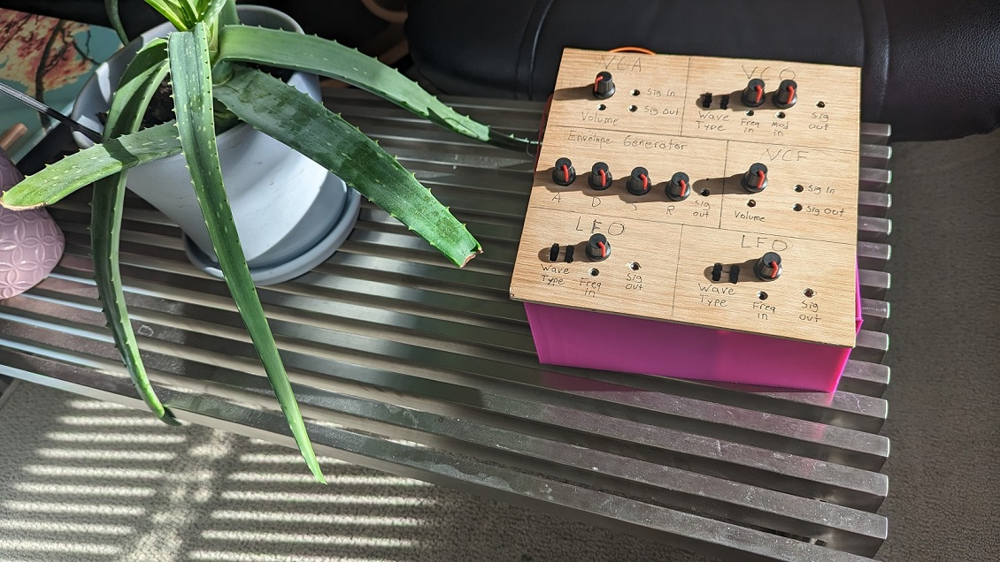
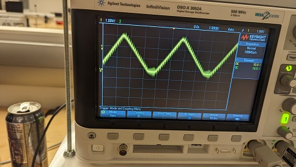
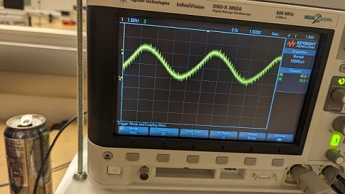
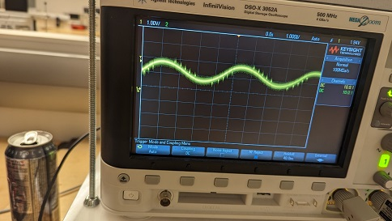
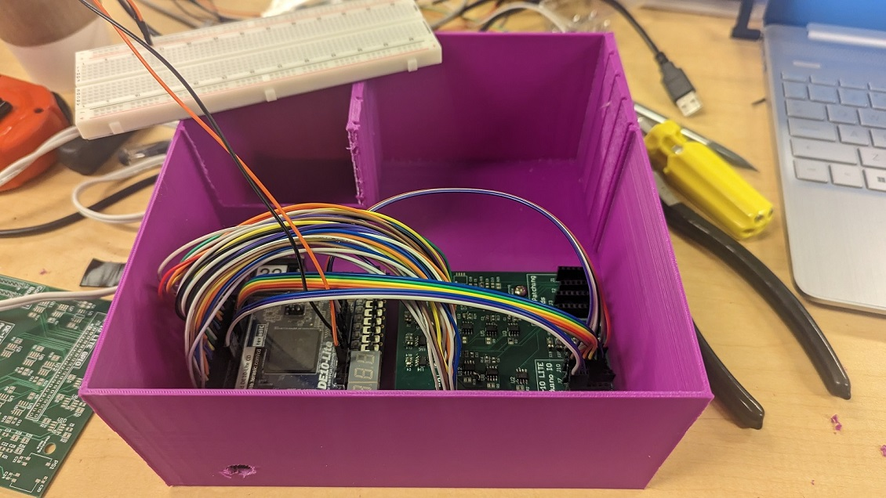

# SemiModularSynth

This project is a digital, modular, patchable electronic music synthesizer designed for use on an Intel DE-10 LITE FPGA, with supporting MCP-3001 ADCs and MCP-4031 DACs. Each module cre

## Audio Signal Modules
### Voltage Controlled Oscillator (VCO)
Creates a sine, triangle, sawtooth, or square wave. Has rough and fine frequency controls and can toggle between wave types.
### Low-pass Voltage Controlled Filter (VCF)
Filters an input signal using a low-pass IIR filter. Cutoff frequency is set by the control signal.  
### Voltage Controlled Amplifier (VCA)
Multiplies the input signal by the control signal to adjust volume

## Control Signal Modules
### Envelope Generator (EG)
Creates a control signal, designed for use with the VCA, that emulates the volume profile of a piano key being struck. Accepts four control signals that accept the shape of the wave (ADSR), and a digital trigger that starts the envelope generation.
### Low Frequency Oscillator (LFO) x2
Similar to the VCO, this generates a sine, triangle, sawtooth, or square wave with a low adjustable frequency (0.1-10 Hz). Used to control other modules.

## Signal Conversion Modules
### MCP3001
Uses SPI to communicate with an external ADC to get a 10-bit digital signal. Triggers a transaction on the rising edge of the sample_clk (44.1 kHz).

### MCP4911
Takes a 10-bit digital signal, and uses SPI to communicate with an external DAC to set the output to the specified voltage. Triggers a transaction using the sample_clk (44.1 kHz).

### ADC_Sampler
Uses the FPGAs onboard ADC to poll all 6 analog input pins. 

##Pictures

###Output of the low-pass VCF with a triangle input and changing cutoff frequency

| High Cutoff | Medium Cutoff | Low Cutoff |
|---------|---------|---------|
|  |  |  |

### Enclosure with PCB

## Demo
Check out the YouTube demo showcasing the functionality of the VCO, VFC, and LFOs:
https://www.youtube.com/shorts/WItJAyof4KM
